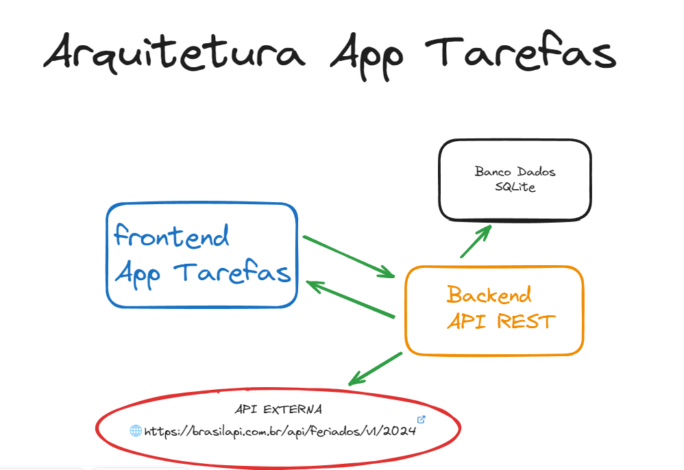

# POS-GRADUAÇÃO ENGENHARIA SOFTWARE PUC/RIO

## TAREFAS FRONTEND

Este pequeno projeto fez parte da avalicao da Sprint: **Arquitetura Software**

O objetivo aqui é ilutsrar o conteúdo apresentado ao longo da disciplina.

---
## SOBRE O PROJETO

App de gerenciamento simples de tarefas, permitindo ao usuário cadastrar, iniciar e concluir tarefas, 
consumindo `mvp-tarefas-backend`, possui um pequeno kanban para facilitar a visualização das tarefas e em que estágio se encontra.

## Estrutura do Projeto

-  `index.html`: Arquivo principal HTML contendo a estrutura da página.

-  `script.js`: Arquivo JavaScript contendo a lógica para consumir as APIs.

-  `Dockerfile`: Arquivo para construção da imagem Docker.

-  `README.md`: Documentação do projeto.

## Pré-requisito

Para executar a aplicação, é necessário que o backend esteja rodando.

O projeto de backend pode ser obtido em:

https://github.com/giovanecs/mvp-tarefas-backend

o projeto de backend realiza uma consulta a uma API externa (https://brasilapi.com.br/api/feriados/v1/2024), sendo necessário esta conectado a internet 
para que o mesmo possa acessa-la.

## Como executar localmente

Basta fazer o download do projeto e abrir o arquivo index.html no seu browser.

## Como executar utilizando Docker

Certifique-se de ter o Docker instalado e em execução em sua máquina.

A partir do diretório raiz do projeto, execute o seguinte comando para construir a imagem Docker:

    $ docker build -t mvp-tarefas-frontend .

Para executar o container basta executar, seguinte o comando:

    $ docker run -d -p 80:80 --name mvp-tarefas-frontend mvp-tarefas-frontend

Para acessar o front-end, basta abrir o http://localhost/ no navegador.